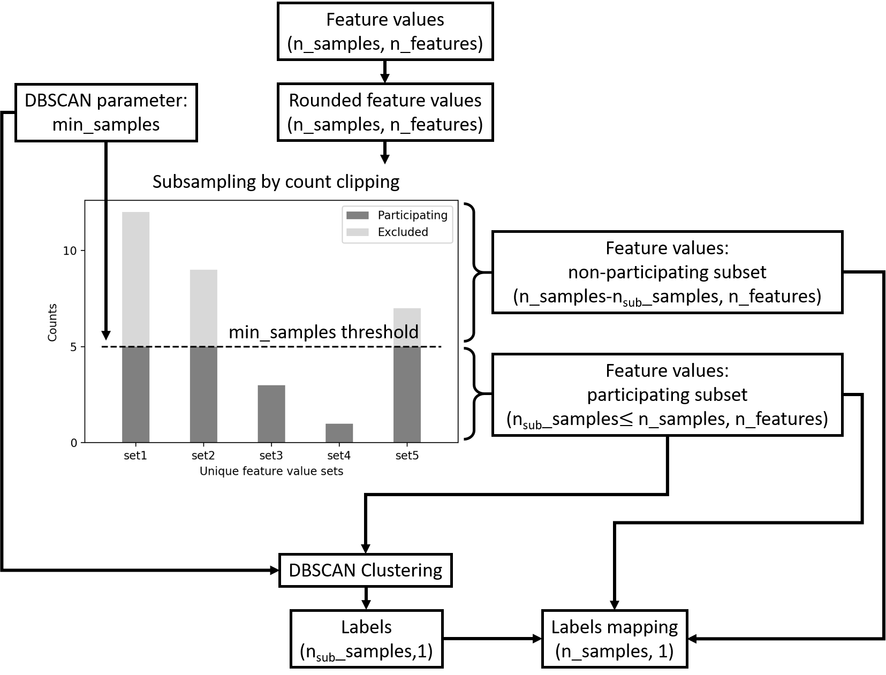

# GridRep

GridRep is a feature transformation tool that enables more efficient BSCAN clustering. 

It is effective for large volumes of low-cardinality input data containing multiple repeating unique sets of feature values.

## preprocess.FeaturesTransformer

The GridRep transformer generates a representative input subset based on DBSCAN's _min_samples_ parameter that participates in the clustering procedure. The generated labels can then be re-mapped back to the original input data.

If the input data does not appear to be of low-cardinality, the GridRep transformer also allows to eliminate suspected false precision (e.g. lots of meaningless decimals after standardisation) by simply passing a _rounding_decimals_ parameter value.


<!--  -->

## cluster.ClippedDBSCAN

ClippedDBSCAN wraps the FeaturesTransformer around sklearn's DBSCAN, in a sklearn.pipeline compatible Estimator.

### Example - Comparison

#### Pipeline clustering


```python
from sklearn.preprocessing import StandardScaler
from sklearn.pipeline import make_pipeline
from sklearn.datasets.samples_generator import make_blobs
from sklearn.preprocessing import FunctionTransformer
from sklearn.cluster import DBSCAN
import numpy as np

from gridrep.cluster import ClippedDBSCAN
```


```python
centers = [(-2, -2), (0, 0), (4.2, 5)]
X, _ = make_blobs(n_samples=20000, centers=centers, n_features=2, random_state=0)

radius = 0.1
min_samples = 7
round_decimals = 1

# ClippedDBSCAN
pipeline_clip = make_pipeline(StandardScaler(), 
                              ClippedDBSCAN(eps=radius,
                                            min_samples=min_samples,
                                            round_decimals=round_decimals))

# DBSCAN
pipeline_noClip = make_pipeline(StandardScaler(), 
                                FunctionTransformer(np.round, 
                                                    validate=False, 
                                                    kw_args={"decimals": round_decimals}),
                                DBSCAN(eps=radius, min_samples=min_samples))
```


```python
%%timeit
pipeline_noClip.fit_predict(X)
```

    317 ms ± 9.21 ms per loop (mean ± std. dev. of 7 runs, 1 loop each)
    


```python
%%timeit
pipeline_clip.fit_predict(X)
```

    36.4 ms ± 479 µs per loop (mean ± std. dev. of 7 runs, 10 loops each)
    
